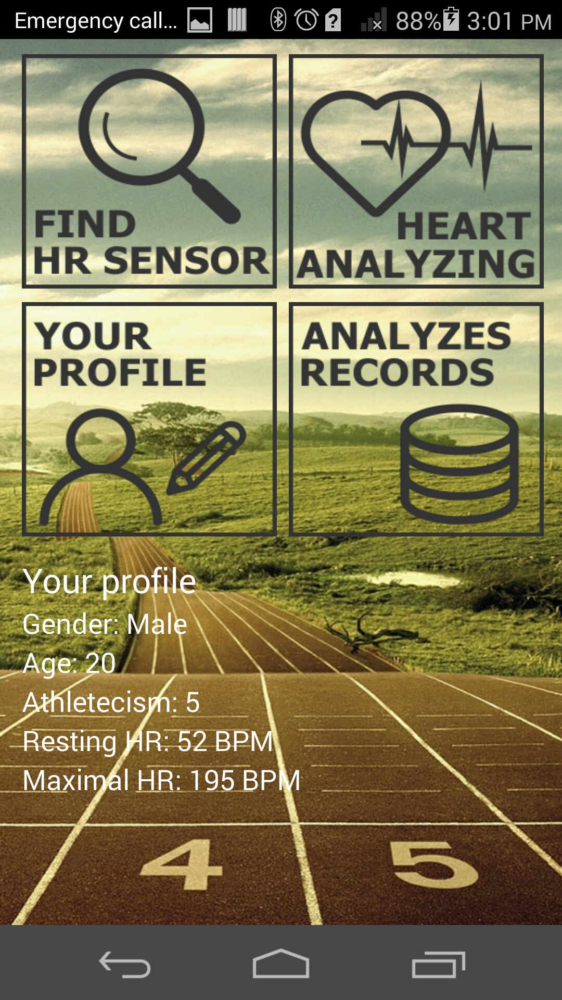
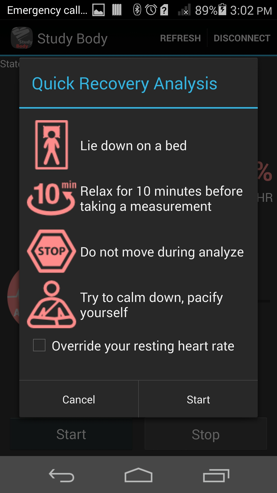
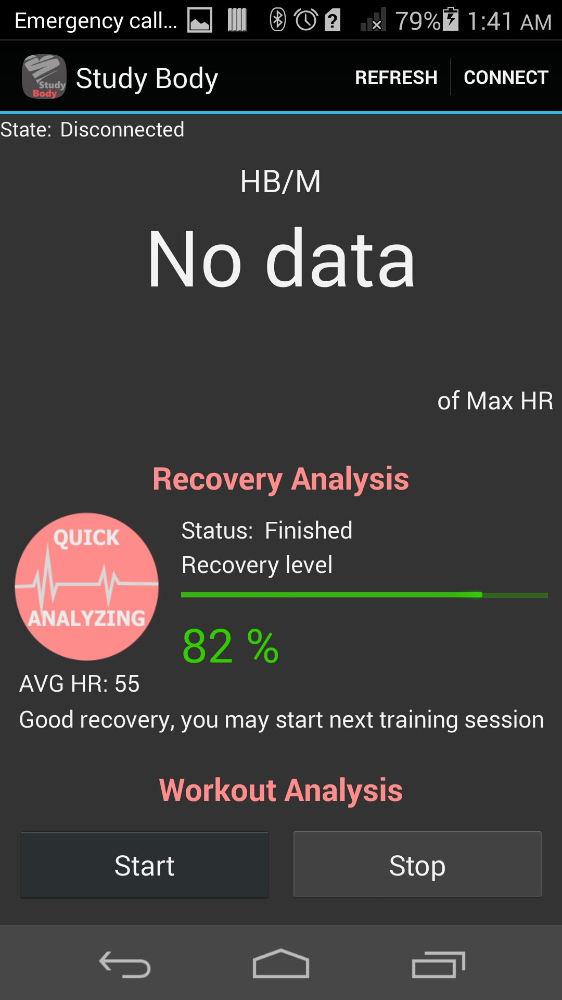
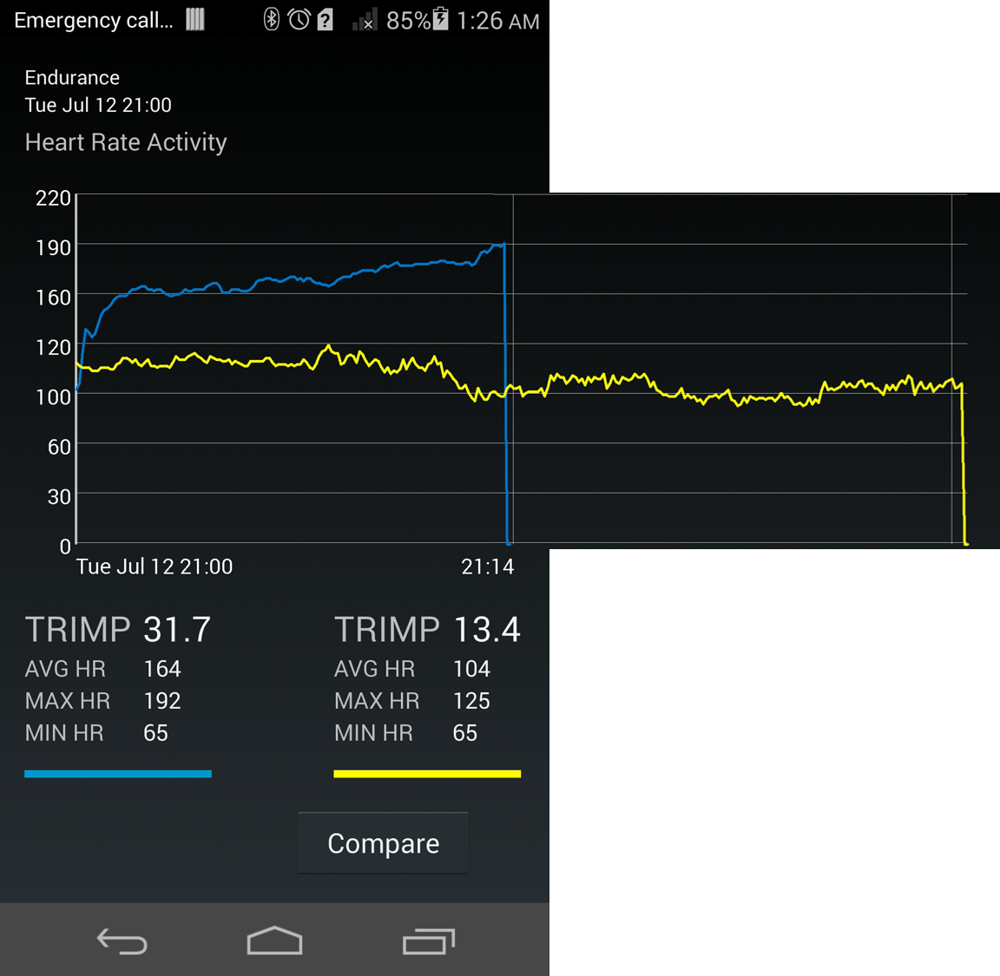

StudyBody Sports Assistant Android App
===================================
Abstract: 
The purpose of this study was to develop a personal sports assisting mobile phone application that works with a wearable heart rate sensor. The application that allows users to both track their fitness and gain a deeper understanding of his or her own body. The application provides functionalities to determine user’s body recovery level based on scientific methods and to do workout analyzes in which user can see effort that he or she made during the training session. Additionally, the app lets user to compare completed training sessions between each other. Also, user can provide his or her own physical data in order to make calculations and analyzes precise within the app.

Introduction 
------------

StudyBody was my Bachelor thesis work. It is based on Google's BluetoothLeGatt project ([Bluetooth LE API][1])

The app was tested on huawei honor device together with heart rate sensor - Polar H7 Heart Rate Sensor developed by Finnish company [Polar][2].

[1]:https://developer.android.com/reference/android/bluetooth/BluetoothGatt.html
[2]:http://www.polar.com/en/products/accessories/H7_heart_rate_sensor

Pre-requisites
--------------

- Android SDK v23
- Android Build Tools v23.0.2
- Android Support Repository

Screenshots // TO EDIT
-------------

 
 

Getting Started
---------------

This sample uses the Gradle build system. To build this project, use the
"gradlew build" command or use "Import Project" in Android Studio.

The best way to try out the app is to use real device. Plug it in, enable Developer setting on phone, and then run the project.

Support
-------

- Google+ Community: https://plus.google.com/communities/105153134372062985968
- Stack Overflow: http://stackoverflow.com/questions/tagged/android

Patches are encouraged, and may be submitted by forking this project and
submitting a pull request through GitHub. Please see CONTRIBUTING.md for more details.

License
-------

Copyright 2014 The Android Open Source Project, Inc.

Licensed to the Apache Software Foundation (ASF) under one or more contributor
license agreements.  See the NOTICE file distributed with this work for
additional information regarding copyright ownership.  The ASF licenses this
file to you under the Apache License, Version 2.0 (the "License"); you may not
use this file except in compliance with the License.  You may obtain a copy of
the License at

http://www.apache.org/licenses/LICENSE-2.0

Unless required by applicable law or agreed to in writing, software
distributed under the License is distributed on an "AS IS" BASIS, WITHOUT
WARRANTIES OR CONDITIONS OF ANY KIND, either express or implied.  See the
License for the specific language governing permissions and limitations under
the License.
