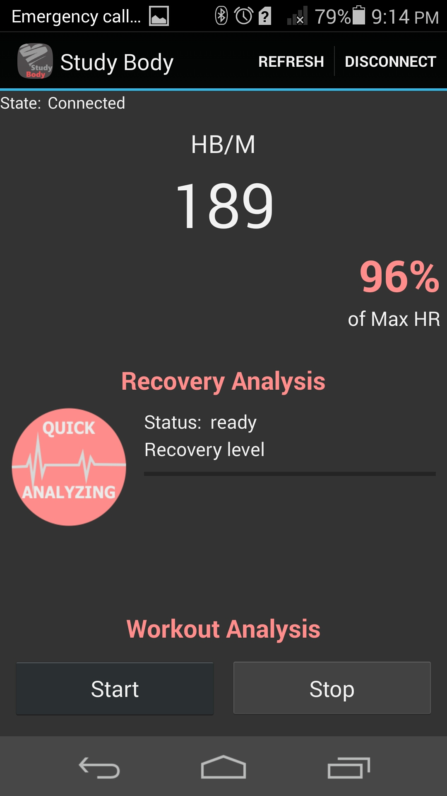

StudyBody Sports Assistant Android App
===================================
Abstract: 
The purpose of this study was to develop a personal sports assisting mobile phone application that works with a wearable heart rate sensor. The application that allows users to both track their fitness and gain a deeper understanding of his or her own body. The application provides functionalities to determine user’s body recovery level based on scientific methods and to do workout analyzes in which user can see effort that he or she made during the training session. Additionally, the app lets user to compare completed training sessions between each other. Also, user can provide his or her own physical data in order to make calculations and analyzes precise within the app.

Introduction 
------------

To reach the goals of this Bchelor degree thesis work was essential to have a real-time heart rate data from a user transmitting into a mobile phone app. All phones with operating system starting from Android 4.3 (API Level 18) have support for Bluetooth Low Energy (BLE) that allows to discover devices and retrieve data from them. Most importantly, the power consumption of BLE is very low, so communication with the heart rate sensor can last for much longer than via normal Bluetooth. The heart rate sensor used in this project is Polar H7 Heart Rate Sensor developed by Finnish company [Polar][2].

Due to the deadlines I was in a hurry to write the thesis paper, so the code looks pretty messy and not everywhere commented. 

[1]:https://developer.android.com/reference/android/bluetooth/BluetoothGatt.html
[2]:http://www.polar.com/en/products/accessories/H7_heart_rate_sensor

Pre-requisites
--------------

- Android SDK v23
- Android Build Tools v23.0.2
- Android Support Repository

Screenshots
-------------

 
 

About the app
-------------

The application allows to create a profile where the user can provide own physical data, 
that increases precision of analyzes within the app. With a paired heart rate sensor, 
user is able to view own heart rate activity and other useful information updating in real time. 

One of the main features of the app is a Recovery Analysis. A one-minute analysis that helps 
user to determine if the body is ready for the next training session. It notifies if the user 
has not fully recovered from last workout and if there is a risk of being injured. Also, the 
user can update own resting heart rate value as he or she gets fitter. 

Another feature in StudyBody is a long-term Workout Analysis of training sessions, where user
can record own heart activity during the workout and store all the data in the database. After
the training is completed user anytime can come back to view and analyze the session. The app
presents data of desired completed training with a graph that shows user’s heart rate activity
during the workout. 

Most importantly, the application displays to user the workload value of specific training
session. It represents the impact of the training session in workload units that are understandable
for the user. With those units user can make a comparison of workload of one training session with 
another or to compare workload values of different users.

Getting Started
---------------

This sample uses the Gradle build system. To build this project, use the
"gradlew build" command or use "Import Project" in Android Studio.
The best way to try out the app is to use real device. Plug it in, enable Developer setting on phone, 
and then run the project.

Support
-------

- Google+ Community: https://plus.google.com/communities/105153134372062985968
- Stack Overflow: http://stackoverflow.com/questions/tagged/android

Patches are encouraged, and may be submitted by forking this project and
submitting a pull request through GitHub. Please see CONTRIBUTING.md for more details.

License
-------

Copyright 2014 The Android Open Source Project, Inc.

Licensed to the Apache Software Foundation (ASF) under one or more contributor
license agreements.  See the NOTICE file distributed with this work for
additional information regarding copyright ownership.  The ASF licenses this
file to you under the Apache License, Version 2.0 (the "License"); you may not
use this file except in compliance with the License.  You may obtain a copy of
the License at

http://www.apache.org/licenses/LICENSE-2.0

Unless required by applicable law or agreed to in writing, software
distributed under the License is distributed on an "AS IS" BASIS, WITHOUT
WARRANTIES OR CONDITIONS OF ANY KIND, either express or implied.  See the
License for the specific language governing permissions and limitations under
the License.
